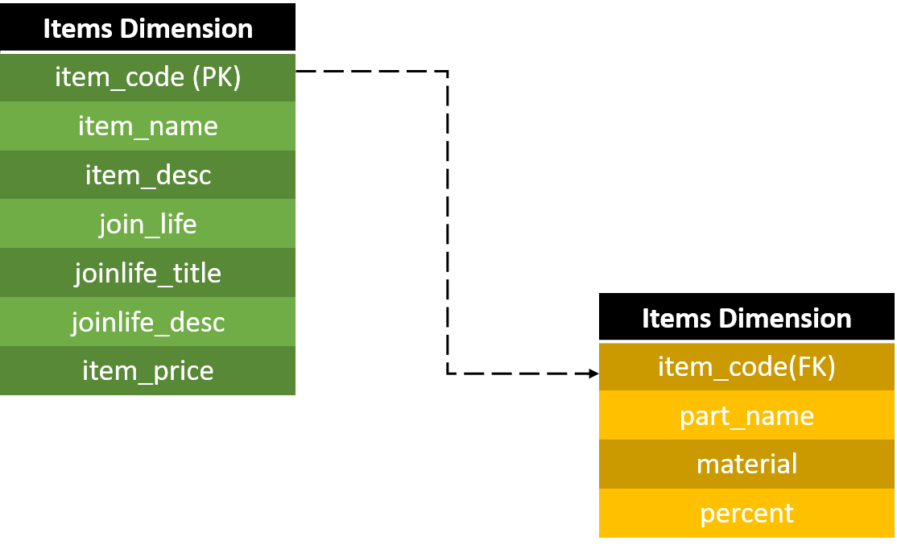

# Descripció del dataset

Tal i com s'explica a l'apartat de *Motivació i Context* el nostre objectiu és aproximar-nos a aquestes dades
per tal de fer un anàlisi preu/impacte ecològic entre les col·leccions ecològiques i no ecològiques d'una 
marca de fast fashion com és Zara. Per tal de fer això, aquest dataset conté tres tipus de dades referents als
items de la col·lecció tardor-hivern:

* Descripció/Composició de a peça
* Etiqueta Eco
* Preu

Amb la descripció/composició juntament amb l'etiqueta, el nostre objectiu és aproximar un estimat relatiu 
de l'impacte ecològic per peça. Mentre que el preu ens proporciona la informació comercial del producte.

És important mencionar que el nostre dataset és una mostra representativa (277 items) però no es tracta
de la col·lecció al complet. A l'apartat **Materials i mètodes** es detalla la seva obtenció i com es podríen
modificar els settings del codi per obtenir variacions en el dataset.

# Contingut

## Camps

### Items Dimension

Aquesta taula consta d'una fila per item tal i com classifica els items l'estructura
interna de la pàgina, és a dir una entrada per categoria d'objecte marquetable. 
Això vol dir que si bé no hi ha una entrada per talla de producte, pot haver entrades
diferents per diferents instàncies del mateix producte mentre existeixin diferències composicionals
(e.g. material/color)

|Nom del camp|Tipus de Dada|Descripció|
|---|---|---|
|item_code|int|Codi únic per item|
|item_name|str|Nom del item|
|item_desc|str|Descripció de l'item|
|join_life|bool|Determina si l'item pertany o no a la col·lecció ecològica|
|joinlife_title|str|Codificació de l'acció ecològica empresa.|
|joinlife_desc|str|Descripció de l'acció ecològica empresa.|
|item_price|int|preu en cèntims d'euro|

### Composition Dimension

Aquesta taula té una granularitat superior i es relaciona amb l'anterior per l'item code,
que en aquest cas NO és identicador unitari. Consta d'una fila per material de la composició. 

|Nom del camp|Tipus de Dada|Descripció|
|---|---|---|
|item_code|int|Clau forània per relacionar |
|part_name|str|Part de la peça de la qual se'n desgranen els components (e.g. FORRO/EXTERIOR)|
|material|str|Nom del material|
|percent|str|Percentatge del material respecte de la part de la peça (e.g. '10%')|

## Model de dades

Les dues taules es relacionen pel camp *item_code*. Hi ha tantes entrades a la taula de composició
per item com materials el composin. 

## Cronologia

Aquest dataset és una mostra de la col·lecció tardaror-hivern 2020 obtinguda del lloc web de ZARA
el 07/11/2020.

## DOI i publicació a Zenodo

Trobareu [aqui](https://zenodo.org/record/4261101#.X6fge1CCGUl) el dataset publicat a Zenodo:

* Títol: **Fast Fashion Eco Commitment Dataset**
* DOI: **10.5281/zenodo.4261101**

# Materials i mètodes

El notebook que hem emprat per obtenir aquest dataset està estructurat de manera que tenim per separat
els següents apartats:

* Llibreries: les llibreries importades pel projecte. 
* Settings: Conjunt de paràmetres d'entrada. Al següent apartat s'explica com es poden modificar per tal d'alterar-ne
            la sortida.
* Functions: Compendi de funcions que s'utilitzen per obtenir el dataset. A l'apartat **Funcions** s'expliquen més en detall. S'han
             dissenyat per ser modulars i la sortida mal·leable per paràmetres.
* Main: Secció on es creen els datasets i s'executen les funcions per omplir-los. Està estructurat així per
        poder comentar fàcilment la definició del dataset en cas de voler concatenar dades d'execucions diferents.

Per generar el dataset que presentem, per facilitat de classificació, es va córrer el codi diverses vegades, una per cada categoria d'item
(*item_types* dels settings), modificant-ne el primer nombre del codi d'item (*code* a settings).

## Settings

L'apartat de settings està pensat de manera que es pugui alterar la sortida en tots el seus aspectes significatius partint sempre de la
mateixa font original (la url del sitemap del loc web de ZARA). Acte seguit trobareu una guia de com utilitzar els settings: 

* **url**: la url del sitemap de ZARA 'https://www.zara.com/sitemaps/sitemap-index.xml.gz'. Aquest paràmetre és fixe, no s'aconsella variació.

* **country**: Aquest paràmetre és un patró que permet filtrar la url del país/idioma que es desitji dels presents al catàleg de ZARA. Per exemple,
          si enlloc de 'sitemap-es-es' s'entra 'sitemap-ch-fr' ens conduirà a la navegació pel catàleg suís de ZARA en francès.

* **gender**: Aquest paràmetre és un patró que permet filtrar el gènere i edat de la roba que volem escrapejar. Lògicament, depèn del paràmetre *country* doncs
        per exemple al catàleg espanyol les opcions serien 'mujer','hombre' o 'niño', mentre que al francès seria 'femme', 'homme' o 'infant'.

* **item_types**: Aquest paràmetre és una llista de patrons per cercar grups d'items. També depèn lingüísticament  del setting *country*. En aquest cas es pot entrar
            tant un grup individual (e.x. ['blusa'], on retornaria el catàleg de bruses) com una sèrie d'items (e.g. ['blusa','falda'] retornaria el catàleg
            de bruses i el de faldilles).

* **keyword_script**: Patró de filtrar.  Aquest paràmetre és fixe, no s'aconsella variació.

* **output**: Enter. Determina la quantitat d'items del catàleg que es volen incorporar al dataset. Si es vol incorporar tot el catàleg complet, cal 
           completar-lo amb **len(item_urls)-1**, altrament qualsevol nombre inferior al volum d'items de la categoria que s'ha determinat a *item_types*
           valdria.

* **file_name_items**: nom del fitxer on volem guardar les nostres dades d'items (e.g. 'items.csv')

* **file_name_comp**: nom del fitxer on volem guardar les nostres dades de composició (e.g. 'composition.csv')

* **code**: Enter. L'índex de l'item al iterar es sumarà al codi en qüestió. Si s'executa el codi vàries vegades sense canviar de dataset, s'aconsella canviar
        el primer dígit per separar-ne les execucions. 

## Funcions

Les funcions estan pròpiament documentades al codi, no obstant això cal mencionar la manera com estan agrupades que ressegueix el camí
que s'ha seguit per l'estructura del lloc web:

 * REQUESTS - SOUP: 
 * ZARA SITE NAVIGATION:
 * DATAFRAME FILLING:
 * STORAGE:
